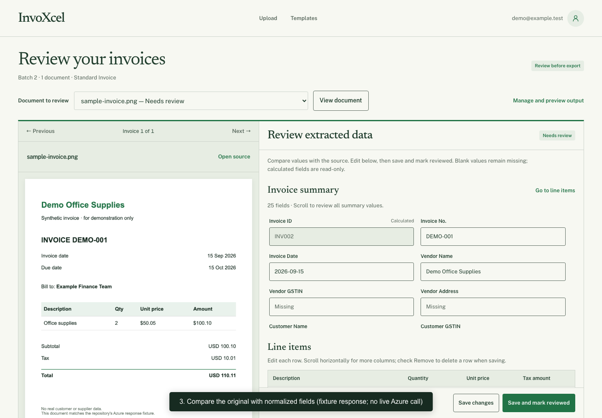

# InvoXcel

Turn invoice documents into structured data you can review, correct, and export to Excel.

InvoXcel is a local Django MVP for accountants, bookkeepers, and finance teams. Azure Document Intelligence reads invoices; InvoXcel normalizes the response, checks the values, and puts the original document beside editable invoice data. You approve the result before exporting it.

## Watch the application walkthrough

[](https://github.com/orbin123/invoxcel/raw/refs/heads/main/assets/demo/walkthrough.mp4)

**[Watch or download the 53-second walkthrough (MP4)](https://github.com/orbin123/invoxcel/raw/refs/heads/main/assets/demo/walkthrough.mp4)**

The recording shows sign-in, template selection, invoice upload, source comparison, summary and line-item edits, review approval, Excel export, and the template register. It is a recording of the running application using a synthetic invoice and the repository's deterministic Azure-response fixture. Extraction in this recording is simulated; it makes no live Azure request. The normal application uses Azure and requires your own credentials. The video has on-screen explanations and no audio.

## What it does

- Accepts up to 10 files per batch: PDF, JPG/JPEG, PNG, BMP, and TIFF. Each file should contain one invoice.
- Stores the source document, raw extraction response, normalized values, and available confidence/provenance information locally.
- Shows source previews beside editable invoice summaries and line items, with validation findings to guide review.
- Supports a standard output template, custom templates, or automatically detected columns. Templates define output data, independent of supplier layouts.
- Lets you change column labels and visibility without calling Azure again. Custom fields without extracted values remain blank for manual entry.
- Saves batches so you can return to them, with accounts and ownership checks for user data.
- Exports saved, reviewed data as XLSX, separate CSV datasets, or JSON.

```text
Upload → Azure extraction → Normalize and validate → Review and edit → Export
```

Invoice summaries and line items are separate datasets throughout this workflow. Confidence values indicate extraction confidence; they are not a guarantee of correctness.

## Run locally

You need Python, Git, and an Azure Document Intelligence resource for live extraction. Development has been verified with Python 3.14 and Django 5.2. Use a project-local virtual environment.

```bash
git clone https://github.com/orbin123/invoxcel.git
cd invoxcel
python3 -m venv .venv
source .venv/bin/activate
python -m pip install -r requirements.txt
cp .env.example .env
```

On Windows, activate the environment with `.venv\Scripts\activate` instead.

Edit `.env` before proceeding:

```dotenv
DJANGO_SECRET_KEY=replace-with-a-long-random-secret
DJANGO_DEBUG=true
DJANGO_ALLOWED_HOSTS=localhost,127.0.0.1
AZURE_DOCUMENT_INTELLIGENCE_ENDPOINT=https://your-resource.cognitiveservices.azure.com/
AZURE_DOCUMENT_INTELLIGENCE_KEY=your-resource-key
AZURE_DOCUMENT_INTELLIGENCE_MODEL=prebuilt-invoice
```

Use the endpoint and key from the same active Azure resource. Keep `.env` private; it is ignored by Git. The full set of options is documented in [.env.example](.env.example).

```bash
python manage.py migrate
python manage.py runserver
```

Open **[localhost:8000](http://localhost:8000/)** and select **Sign up** to create a local account. Use `localhost` consistently, including when configuring optional Google sign-in.

To access Django Admin, create a superuser:

```bash
python manage.py createsuperuser
```

Then open **[localhost:8000/admin/](http://localhost:8000/admin/)**. Google sign-in is optional: set the two `GOOGLE_OAUTH_*` variables in `.env.example` and register `http://localhost:8000/accounts/google/callback/` as the redirect URI.

## Extract, review, and export an invoice

1. Sign in and choose **Standard Invoice**, a custom template, or **None — automatically detect columns**.
2. Choose your invoice documents and click **Extract invoices**. Keep the page open while synchronous extraction completes.
3. Compare the source preview with the extracted values. Correct summary fields and add, edit, or remove line items as needed.
4. Inspect the extraction and programmatic checks. Missing values stay blank; unresolved findings remain visible in the appropriate exports.
5. Click **Save and mark reviewed** for every extracted invoice in the batch.
6. Choose an export format and click **Export**. Further edits require saving and review again before export.

**My batches** reopens saved work. **Manage columns and missing values** controls batch column labels and visibility; changing these does not reprocess the document. A failed extraction retains its upload and offers **Retry extraction**.

| Export | Contents |
| --- | --- |
| Excel (`.xlsx`) | Invoice Summary, Line Items, and Exceptions worksheets |
| Invoice summary (`.csv`) | One row per invoice, in selected column order |
| Line items (`.csv`) | Separate item rows linked to their source document |
| JSON (`.json`) | Related invoice summaries, items, findings, and output metadata |

Failed documents are excluded from invoice datasets and listed as exceptions in XLSX/JSON. In the standard template, Invoice ID is generated from the source document ID; Invoice No. is the supplier's invoice number. The numeric part of Invoice ID links to Document ID in the line-item CSV.

## Azure configuration and troubleshooting

The adapter uses the invoice model through REST API version `2024-11-30`. It submits document bytes and polls synchronously with a configurable timeout. It requests no optional Azure add-ons and does not automatically resubmit failures.

The configured defaults are **500 MB per file**, **2,000 PDF/TIFF pages**, and a **90-second polling window**. These are application limits, not a promise that large files will finish before the timeout. Adjust them to match your Azure resource. For an F0 resource, configure:

```dotenv
AZURE_DOCUMENT_INTELLIGENCE_MAX_BYTES=4194304
AZURE_DOCUMENT_INTELLIGENCE_MAX_PAGES=2
```

Live uploads use your Azure resource and may consume quota or incur charges. Tests use fixtures and do not contact Azure.

Check the connection without uploading an invoice:

```bash
python manage.py check_azure
```

HTTP 200 verifies resource authentication; it does not verify extraction of a particular document. For authentication failures, check the subscription status, matching endpoint/key, and environment variables overriding `.env`. Restart Django after changing configuration. See the [Azure diagnostic guide](apps/processing/management/README.md) for details.

## Development and verification

```bash
python manage.py check
python manage.py makemigrations --check --dry-run
python manage.py test
```

The current suite contains 88 tests covering authentication/ownership, templates, upload validation, provider errors, normalization, editing/review, source previews, and exports. It injects deterministic provider responses rather than making paid requests.

```text
config/          Django settings and routing
apps/accounts/   Local accounts, sessions, and optional Google sign-in
apps/uploads/    Upload validation, storage, and document previews
apps/templates/  Output schemas and ordered columns
apps/processing/ Batch processing and extraction orchestration
apps/invoices/   Normalized summaries, line items, and validation
apps/workspace/  Source comparison, editing, and review
apps/exports/    XLSX, CSV, and JSON generation
services/        Azure adapter and field mapping
tests/fixtures/  Deterministic extraction response
assets/demo/     Recorded walkthrough and synthetic demonstration assets
```

## Current scope

This is a local development MVP, not a production deployment. Run it on loopback with Django's development server. SQLite holds application data; `media/` holds original uploads. Both persist locally and are excluded from Git along with credentials and `.venv/`.

Processing is synchronous. Multiple invoices in a single file, background workers, team collaboration, accounting integrations, arbitrary AI enrichment of custom fields, and production infrastructure are outside the current scope. Review every invoice against its source before using exported financial data.

[CLAUDE.md](CLAUDE.md) and [AGENTS.md](AGENTS.md) describe repository contribution rules. Some historical guide text still describes the project before its scaffold existed; this README describes the current implementation and local run path.
